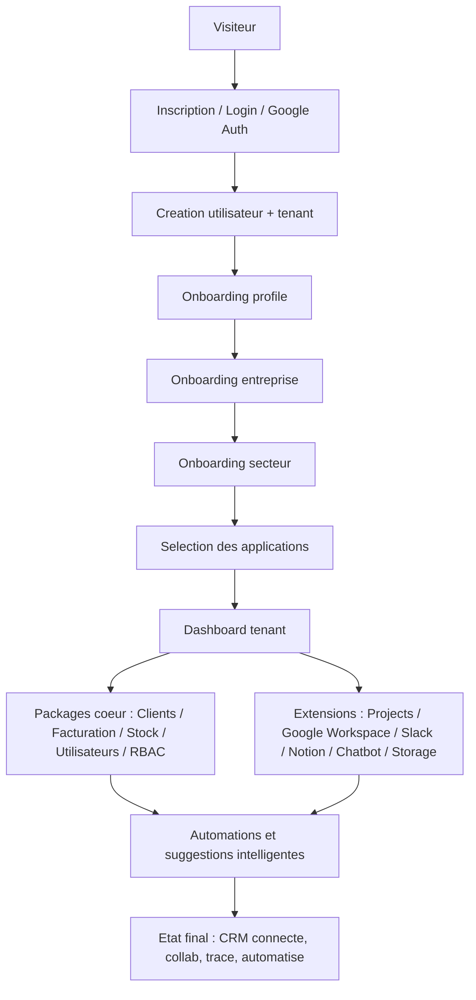

# Scenarios Projet CRM - De l'inscription a l'etat final

## Objectif
Ce document resume le parcours produit du CRM Laravel depuis l'arrivee d'un nouvel utilisateur jusqu'a un etat final de CRM connecte, automatise et multi-equipes.

Il couvre :
- le coeur applicatif
- les packages metier
- les extensions Marketplace implementees dans ce repository
- les dependances et enchainements entre modules

Perimetre de ce document :
- packages locaux sous `packages/vendor/*`
- extensions locales sous `extensions/*`
- logique applicative globale dans `app/*`, `routes/*` et `resources/*`

## Vue d'ensemble

## 1. Parcours principal de bout en bout

### Phase 1 - Arrivee, inscription et authentification
Scenario :
- un visiteur arrive sur `/`
- s'il n'est pas connecte, il est redirige vers `/login`
- il peut :
  - creer un compte classique
  - se connecter
  - utiliser Google OAuth

Modules impliques :
- application Laravel principale
- logique Auth dans `app/Http/Controllers/Auth/*`
- package `crm-core` pour le contexte tenant

Resultat attendu :
- un utilisateur existe
- un tenant existe ou est associe
- la session applicative est ouverte

### Phase 2 - Verification et activation du contexte tenant
Scenario :
- une fois connecte, le systeme determine le tenant actif
- les middlewares protegent l'acces, l'activite de l'utilisateur et le contexte multi-tenant

Modules impliques :
- package `crm-core`
- middlewares applicatifs
- package `user`

Resultat attendu :
- toutes les actions suivantes sont scopees par `tenant_id`
- l'utilisateur opere dans le bon espace entreprise

### Phase 3 - Onboarding initial
Scenario :
- si l'onboarding n'est pas termine, l'utilisateur est redirige vers `/onboarding`
- le wizard collecte :
  - profil
  - informations entreprise
  - secteur
  - applications a activer au depart

Applications proposees nativement dans l'onboarding :
- `clients`
- `stock`
- `invoice`
- `projects`
- `notion-workspace`
- `google-drive`
- `google-calendar`
- `google-sheets`
- `google-docx`
- `google-gmail`

Modules impliques :
- `OnboardingController`
- package `extensions`
- package `crm-core`

Resultat attendu :
- le profil utilisateur est renseigne
- les parametres du tenant sont initialises
- le secteur d'activite sert aux recommandations
- une premiere base d'applications peut etre activee

### Phase 4 - Tableau de bord et premiere mise en service
Scenario :
- l'utilisateur arrive sur `/dashboard`
- le dashboard consolide les donnees disponibles selon les tables et modules actifs :
  - clients
  - factures
  - paiements
  - projets
  - taches
  - stock
  - activites recentes

Modules impliques :
- application principale
- packages `client`, `invoice`, `stock`
- extension `projects`

Resultat attendu :
- le tenant dispose d'une vue de pilotage centralisee
- le dashboard devient l'entree dans les workflows metier

## 2. Scenarios metier coeur

### Scenario A - CRM commercial de base
Objectif :
- structurer le portefeuille clients

Parcours :
1. activer le module `clients`
2. creer, modifier et consulter les fiches clients
3. enrichir les profils avec notes, categorie, tags, contact, suivi
4. utiliser les suggestions Marketplace pour installer les modules complementaires

Modules impliques :
- package `client`
- package `extensions` pour activation et recommandations
- package `automation` pour suggestions intelligentes

Valeur finale :
- le tenant dispose d'un referentiel client central

### Scenario B - Facturation et cycle revenu
Objectif :
- transformer la relation client en devis, facture, paiement et reporting

Parcours :
1. activer `invoice`
2. creer un devis ou une facture
3. rattacher la facture a un client si le module `clients` est actif
4. gerer lignes, taxes, remises, moyens de paiement
5. enregistrer les paiements
6. produire exports, PDF et rapports

Modules impliques :
- package `invoice`
- package `client`
- package `automation`

Valeur finale :
- le tenant dispose d'un cycle simple "client -> facture -> paiement -> reporting"

### Scenario C - Stock et articles
Objectif :
- ajouter une logique de produits, fournisseurs et commandes

Parcours :
1. activer `stock`
2. gerer articles et niveaux
3. gerer fournisseurs
4. suivre commandes d'approvisionnement
5. connecter facturation ou clients quand c'est pertinent

Modules impliques :
- package `stock`
- package `invoice`
- package `client`

Valeur finale :
- le CRM evolue d'un outil commercial vers un outil commercial + operations

### Scenario D - Utilisateurs, invitations et gouvernance
Objectif :
- faire monter le tenant en equipe

Parcours :
1. inviter de nouveaux membres
2. accepter l'invitation
3. gerer roles, appartenance tenant et permissions
4. distinguer proprietaire, admin, manager, user selon la configuration

Modules impliques :
- package `user`
- package `rbac`
- `tenant_user_memberships`
- package `automation` pour l'onboarding d'equipe

Valeur finale :
- le CRM n'est plus mono-utilisateur
- les droits sont cadres

## 3. Scenarios extensions et ecosysteme connecte

### Scenario E - Marketplace et activation applicative
Objectif :
- permettre au tenant d'activer les modules utiles au bon moment

Parcours :
1. ouvrir `Marketplace`
2. consulter les fiches application
3. activer ou desactiver
4. ouvrir les pages de configuration
5. revenir sur `Mes applications`

Modules impliques :
- package `extensions`
- routes `marketplace.*`

Valeur finale :
- le CRM devient modulaire et progressif

### Scenario F - Gestion de projets et execution
Objectif :
- livrer ce qui a ete vendu

Parcours :
1. activer `projects`
2. creer un projet
3. lier un client si `clients` est actif
4. assigner membres, taches, checklist, commentaires et fichiers
5. suivre le travail en board / vue projet
6. synchroniser calendrier et stockage selon les extensions actives

Modules impliques :
- extension `projects`
- package `client`
- extension `google-calendar`
- extension `google-drive`
- extension `dropbox`

Valeur finale :
- le CRM relie vente, execution et collaboration

### Scenario G - Google Calendar
Objectif :
- synchroniser rendez-vous, jalons et planification

Parcours :
1. activer `google-calendar`
2. connecter le compte Google
3. selectionner le calendrier cible
4. synchroniser evenements
5. creer des evenements depuis les workflows projet ou automation

Valeur finale :
- les echanges clients et les projets se traduisent en calendrier

### Scenario H - Google Drive
Objectif :
- centraliser les fichiers de travail

Parcours :
1. activer `google-drive`
2. connecter le compte Google
3. creer dossiers
4. uploader, renommer, deplacer, partager, supprimer, restaurer
5. rattacher les fichiers a des projets et taches

Valeur finale :
- les assets de livraison et les pieces jointes sont centralises

### Scenario I - Dropbox
Objectif :
- proposer un stockage alternatif ou complementaire a Google Drive

Parcours :
1. activer `dropbox`
2. connecter Dropbox
3. gerer fichiers et dossiers
4. brancher les automatisations projet vers Dropbox

Valeur finale :
- le tenant choisit son backend documentaire

### Scenario J - Google Sheets
Objectif :
- travailler les tableaux et exports operationnels

Parcours :
1. activer `google-sheets`
2. connecter Google
3. creer ou dupliquer des feuilles
4. lire, ecrire, append et nettoyer des plages
5. utiliser les feuilles comme support d'analyse ou partage

Valeur finale :
- le CRM s'ouvre vers la manipulation tabulaire collaborative

### Scenario K - Google Docs
Objectif :
- generer ou maintenir des documents collaboratifs

Parcours :
1. activer `google-docx`
2. connecter Google
3. creer, renommer, dupliquer et exporter des documents
4. append / replace de contenu
5. s'en servir pour propositions, specs, comptes rendus ou livrables

Valeur finale :
- les documents longs sortent du simple champ texte CRM

### Scenario L - Gmail
Objectif :
- connecter les emails au CRM

Parcours :
1. activer `google-gmail`
2. connecter Google
3. lire labels, messages et stats
4. envoyer des emails depuis le module
5. sauvegarder la configuration metier

Valeur finale :
- le CRM commence a couvrir la communication sortante

### Scenario M - Google Meet
Objectif :
- planifier ou suivre les reunions en lien avec le travail CRM

Parcours :
1. activer `google-meet`
2. connecter Google
3. choisir le calendrier
4. synchroniser ou creer des reunions

Valeur finale :
- les rendez-vous visio sont relies au contexte client / projet

### Scenario N - Slack
Objectif :
- diffuser les evenements CRM dans les canaux de travail

Parcours :
1. activer `slack`
2. connecter Slack
3. selectionner canal
4. synchroniser
5. envoyer des messages ou notifications

Valeur finale :
- l'equipe suit l'activite CRM sans quitter son espace de communication

### Scenario O - Notion Workspace
Objectif :
- gerer un espace de pages collaboratives interne au CRM

Parcours :
1. activer `notion-workspace`
2. creer, modifier, dupliquer, deplacer et partager des pages
3. marquer des favoris
4. consulter l'activite d'une page

Valeur finale :
- le CRM gagne une couche base de connaissance / documentation

### Scenario P - Chatbot
Objectif :
- structurer une experience conversationnelle interne ou communautaire

Parcours :
1. activer `chatbot`
2. creer des rooms
3. lister utilisateurs et messages
4. envoyer, rechercher et supprimer des messages

Valeur finale :
- le CRM ajoute une couche conversationnelle temps reel ou quasi temps reel

## 4. Automatisation, intelligence et reprise de travail

### Scenario Q - Suggestions automatiques
Objectif :
- pousser les prochaines actions les plus utiles selon le contexte

Exemples visibles dans le code :
- apres creation client
- apres creation facture
- apres invitation utilisateur
- apres creation projet
- apres creation tache projet
- pour installation d'extensions manquantes

Modules impliques :
- package `automation`
- package `extensions`
- modules metier source d'evenements

Valeur finale :
- le CRM n'est plus passif
- il recommande les actions suivantes

### Scenario R - Auto-save / drafts
Objectif :
- eviter la perte d'information pendant la saisie

Etat actuel cible :
- brouillons multi-tenant
- autosave silencieux
- reprise de brouillon
- purge apres validation finale
- rappel planifie si l'action n'est pas finalisee

Formulaires deja branches dans le perimetre courant :
- client create
- invoice create
- project create
- task create

Valeur finale :
- le CRM se comporte comme un outil moderne de reprise instantanee

## 5. Role de chaque package coeur

| Package | Role principal | Moment du parcours | Dependances visibles |
|---|---|---|---|
| `crm-core` | base tenant, config coeur, contexte multi-tenant | des l'inscription | app principale |
| `user` | utilisateurs, invitations, acceptation, equipe | onboarding et croissance | `rbac`, `crm-core` |
| `rbac` | roles et permissions par tenant | gouvernance | `user`, `crm-core` |
| `extensions` | catalogue, Marketplace, activation, settings | onboarding puis evolution | tous les modules activables |
| `automation` | suggestions et actions automatiques | apres les evenements metier | `extensions`, modules source |
| `client` | referentiel client | CRM de base | `invoice`, `projects`, `stock` |
| `invoice` | devis, factures, paiements, reporting | montee en revenu | `client`, `stock`, `automation` |
| `stock` | articles, fournisseurs, commandes | operations | `invoice`, `client` |

## 6. Role de chaque extension implementee

| Extension | Role | Scenarios typiques | Dependances / liens |
|---|---|---|---|
| `projects` | execution, taches, collaboration | livrer un deal, coordonner l'equipe | `client`, `google-calendar`, `google-drive`, `dropbox` |
| `google-calendar` | agenda et synchro evenements | onboarding, projets, rappels | Google OAuth |
| `google-drive` | stockage fichiers Google | projets, pieces jointes, dossiers | Google OAuth |
| `dropbox` | stockage alternatif | projets, automatisations fichiers | Dropbox OAuth |
| `google-sheets` | feuilles collaboratives | analyses, exports, tableaux | Google OAuth |
| `google-docx` | documents collaboratifs | propositions, specs, CR | Google OAuth |
| `google-gmail` | messages email | communication client | Google OAuth |
| `google-meet` | reunions visio | rendez-vous et coordination | Google OAuth, calendrier |
| `notion-workspace` | base de connaissance interne | docs, pages, partage | gestion de pages interne |
| `slack` | notifications et messages equipe | alertes, diffusion d'activite | Slack OAuth |
| `chatbot` | rooms et messages | conversation interne / support | module autonome |

## 7. Enchainements et dependances importantes

### Chaines de valeur metier
- `client -> invoice -> payment -> dashboard`
- `client -> project -> task -> calendar`
- `project -> drive/dropbox -> docs/sheets -> slack`
- `user invited -> automation -> task onboarding / calendar meeting`

### Dependances fonctionnelles fortes
- `projects` devient plus riche si `clients` est actif
- `projects` gagne de la valeur si `google-calendar` est actif
- `projects` gagne une vraie couche documentaire si `google-drive` ou `dropbox` est actif
- `invoice` gagne en pertinence si `clients` est actif
- `automation` depend de la presence des modules cibles pour executer les suggestions

### Dependances techniques transverses
- `tenant_id` est obligatoire dans la logique metier
- OAuth est central pour les modules Google, Slack et Dropbox
- le Marketplace reste la porte d'entree des activations
- le dashboard consolide seulement ce qui existe et ce qui est actif

## 8. Scenario final cible

Etat final d'un tenant mature :
- l'entreprise est onboardee
- les roles et membres sont en place
- le module Clients structure le pipe commercial
- la Facturation transforme les opportunites en revenu
- le Stock supporte l'operationnel si besoin
- les Projets assurent l'execution et le suivi
- Google Calendar, Drive, Sheets, Docs, Gmail et Meet couvrent le workspace Google
- Slack relaye les evenements dans la communication d'equipe
- Notion Workspace sert de couche documentaire interne
- Chatbot ouvre un canal conversationnel natif
- l'Automation propose ou execute les suites logiques
- les Drafts evitent la perte de saisie et relancent les actions inachevees

En resume :
- le produit commence comme un CRM simple
- evolue en plateforme modulaire multi-tenant
- finit en CRM connecte, collaboratif, documente et automatise

## 9. Note de cadrage
Ce document couvre les modules reellement presents dans ce repository.

Le catalogue Marketplace seed aussi d'autres slugs externes ou plus "catalogue" que "code local" (exemple : Microsoft Teams, Twilio SMS, Zapier, Stripe Payments, QuickBooks, IA generique). Ils peuvent faire partie de la vision produit globale, mais ne sont pas inclus ici comme modules locaux complets au meme niveau que les packages et extensions implementes dans ce repo.
